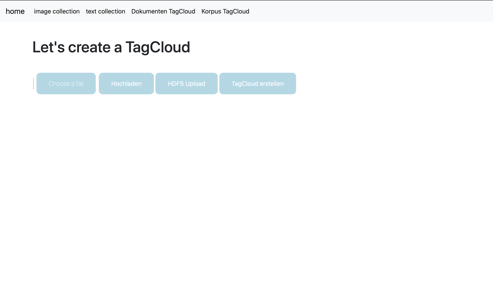
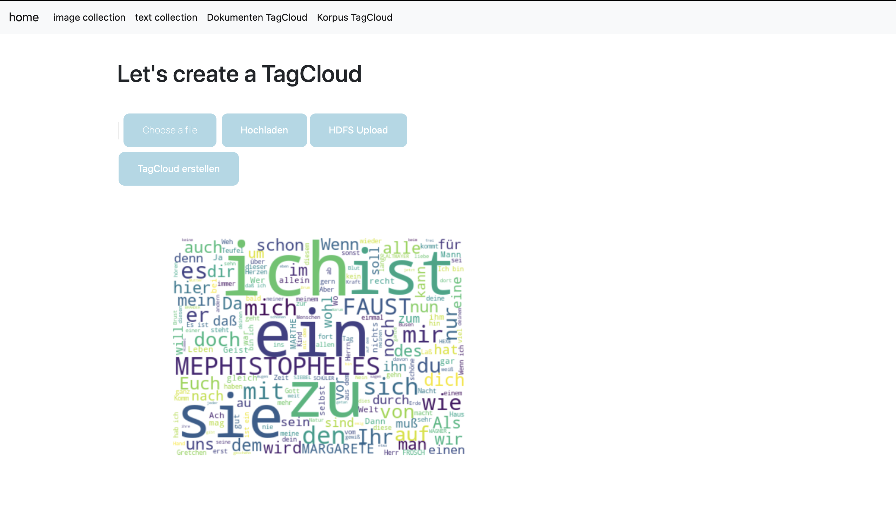
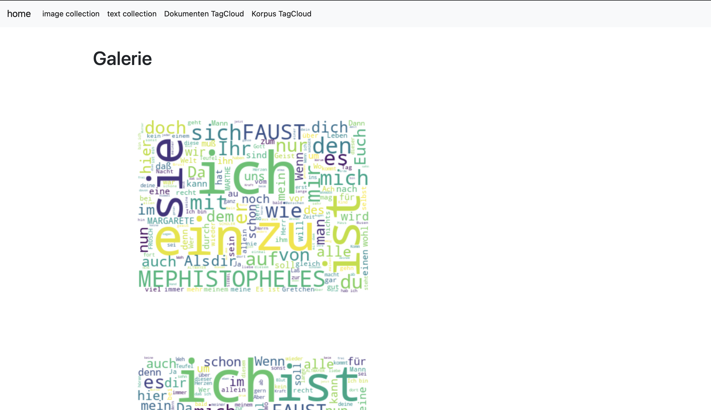
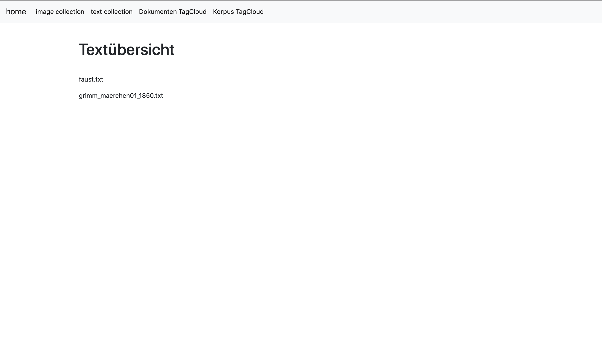
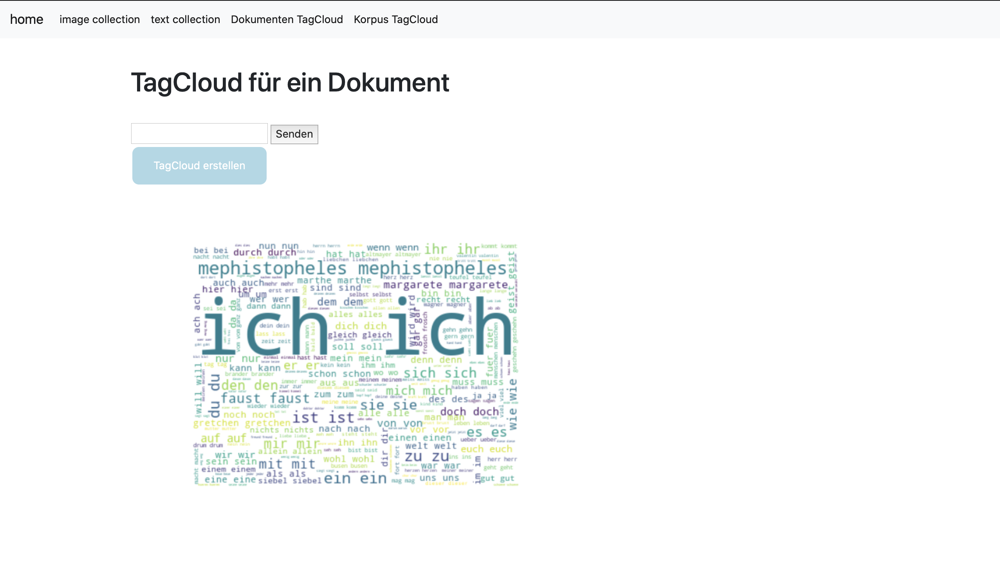
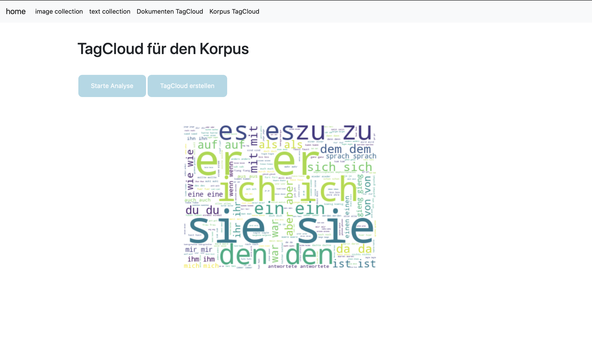

# BDEA_MapReduce-LambdArchitecture
Das Ziel dieser Übung ist die Entwicklung einer auf Lambda-Architektur basierenden Applikation zur Erstellung von TagClouds, die 
folgende Funktionalitäten unterstützen sollte:

- Upload von Text-Dateien über eine Web-Schnittstelle und Speicherung im Dateisystem (hier wurde das HDFS verwendet)
- Direkte Erzeugung einer TagCloud pro hochgeladener Datei
- Auswahl einer TagCloud aus einer Liste aller hochgeladenen Dateien und Anzeige der TagCloud im Browser
- Per Hand(=Klick) auslösbarer M/R-WordCount, der eine normalisierte TagCloud für den gesamten Dokumentenbestand erzeugt
- Erzeugung einer normaliserten TagCloud für ein Dokument

Die komplette Applikation verwendet einen Docker Container (Cloudera Quickstart), der Hadoop beinhaltet. Die Docker Container ID muss vom Anwender angepasst werden und es muss sichergestellt werden, dass im src Verzeichnis die Ordner Flask_textcollection und Flask_imgcollection vorhanden sind. 

Im folgenden Abschnitt werden Bilder der Applikation dargestellt.

# Startseite

# Starteite mit TagCloud

# Image Collection

# Text Collection

# Normalisierte TagCloud für ein Dokument

# Normalisierte TagCloud für alle Dokumente

